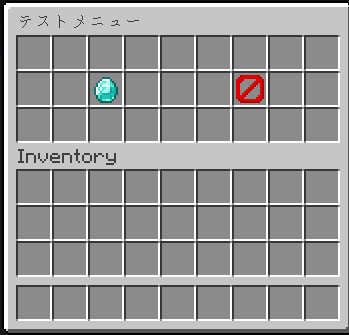

# AceLib
## InvUI
```java
 ui = new InvUi(id,plugin,SlotSize,titleText);
```

### addButton
addButton(SlotNumber,DisplayName,MaterialID,method);<br>
add Button(Map<Integer,Button>)

### deleteButton
deleteButton(SlotNumber);<br>
delete Button,in this number slot.

### getButton
 getButton();<br>
 get Buttons(Map<Integer,Button(ItemStack,Consumer<Player>)>)

### build
build();
get this Button,Cast to Inventory

### open
open(Player);<br>
open this InventoryUI.<br>
Internally, it uses the build method.

### Example
```java
testUI = new InvUI("test_ui", this, 27, "テストメニュー");
testUI.addButton(11, "ダイヤをもらう", "DIAMOND", player -> {
        player.getInventory().addItem(new ItemStack(Material.DIAMOND, 1));
        });
testUI.addButton(15, "閉じる", "BARRIER", player -> {
        player.closeInventory();
        });

testUI.open(player);
```


## UIRegister
### How to Use
```java
    ItemStack icon = new ItemStack(Somethins.Material);
    InvUI ui = new InvUI("id",plugin,size,"title");
    ui.addButton(slot,"name1","materialID",player->{method});
    ui.addButton(slot,"name2","materialID",player->{method});
    //add some Buttons
    ~~
    //create UI Data
    UIRegisterData data = new UIRegisterData(plugin, "subGame1", icon, ui);
    
    //Register Event
    Bukkit.getServer().getPluginManager().callEvent(new UIRegisterEvent(data));
```
## API Util
### How to Use
```java
    Map<String, Object> winData = Api.RequestAPI("game_result/wins", 10, 2);
    System.out.println("ゲーム名: " + winData.get("game_name"));
    System.out.println("勝利数: " + winData.get("wins"));

    Map<String, Object> record = AcelibAPI.RequestAPI("game_result/recode", 10, 2, true);
    System.out.println(record.get("success"));
```
Api.Request("endPoint",schemas)
return Map<String,Object(result)>

This method automatically retrieves the structure from the API's `/openapi.json`, so there is no need to update the library every time the API is updated.